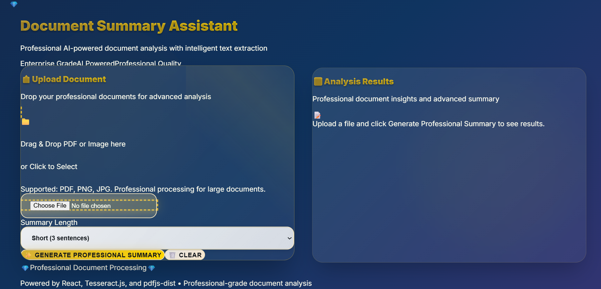

<h1 align="center">Document Summary Assistant</h1>

<p align="center">
  <strong>AI-powered summarization for PDFs and images</strong><br>
  <em>Extract, summarize, and understand documents in seconds!</em>
</p>

<p align="center">
  <a href="https://github.com/Smriti1511s/Document-Summary-Assistant/stargazers">
    
  </a>
  <a href="https://github.com/Smriti1511s/Document-Summary-Assistant/issues">
    
  </a>
  <a href="https://github.com/Smriti1511s/Document-Summary-Assistant/blob/main/LICENSE">
    
  </a>
</p>

---

## 🚀 Features

- 📄 **Extract text from PDF files**
- 🖼️ **OCR support for scanned images (JPG/PNG)**
- ✂️ **Automatic text summarization for quick insights**
- 🔑 **Keyword extraction to highlight main topics**
- ⏳ **Loading indicators for smooth user experience**
- ⚠️ **Basic error handling for unsupported/invalid files**
- 🖱️ **Drag-and-drop interface for easy uploads**
- ⚡ **Real-time results, no waiting!**

---

## 🛠️ Tech Stack

- **Frontend:** React + TailwindCSS  
- **PDF Parsing:** pdfjs-dist  
- **OCR:** Tesseract.js  
- **Summarization/Keywords:** Custom NLP text processing

---

## 📦 Installation & Setup

1. **Clone this repository:**
   ```bash
   git clone https://github.com/Smriti1511s/Document-Summary-Assistant.git
   cd Document-Summary-Assistant
   ```

2. **Install dependencies:**
   ```bash
   npm install
   ```

3. **Run locally:**
   ```bash
   npm start
   ```
   Open [http://localhost:3000](http://localhost:3000) in your browser.

---

## ✨ Demo

<!-- Add screenshot or GIF here for extra appeal! -->
<p align="center">
  
</p> 

---

## 🤝 Contributing

Contributions and feedback are welcome!  
- Fork the repo  
- Create a new branch  
- Commit your changes  
- Open a pull request

---

## 📄 License

This project is licensed under the [MIT License](LICENSE).

---

<p align="center">
  <em>Summarize smarter, read faster, understand better.</em>
</p>